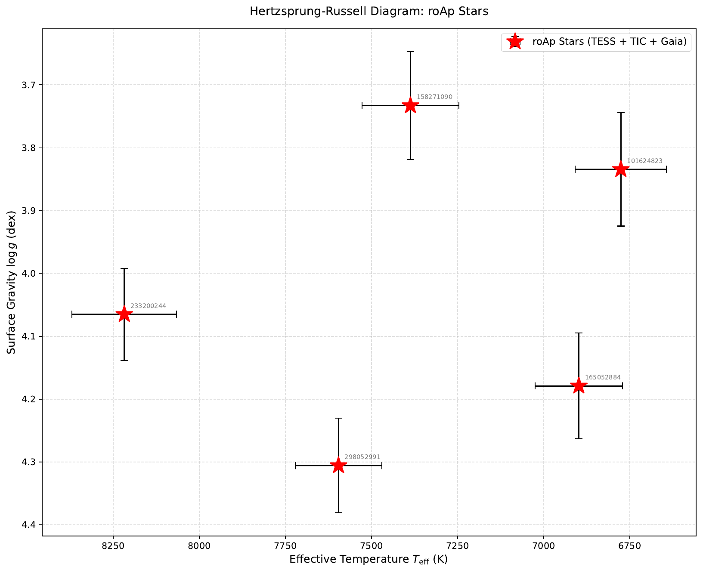
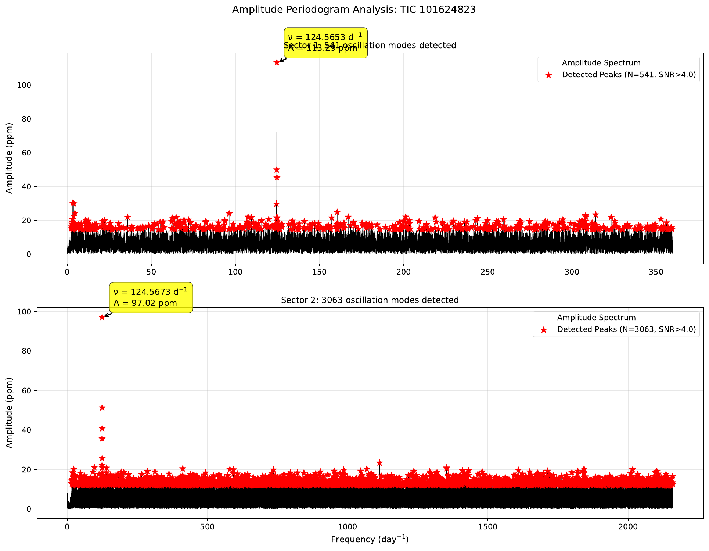
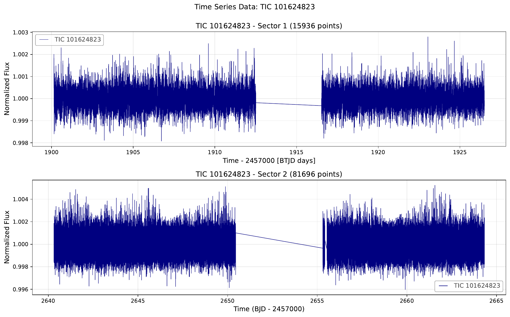

# Asteroseismic Analysis of Rapidly Oscillating Ap Stars

[](https://www.python.org/downloads/)
[](LICENSE)
[](https://tess.mit.edu/)
[]()

## 🌟 Overview

A comprehensive, publication-ready Python framework for **asteroseismic analysis** of rapidly oscillating Ap (roAp) stars using NASA's **TESS mission** data. This repository integrates modern astronomical catalogs (TESS Input Catalog, Gaia DR3) with state-of-the-art frequency analysis techniques to characterize the internal structure and physical properties of these rare, magnetically-active A-type pulsators.

### ✨ Why roAp Stars?

roAp stars are uniquely valuable laboratories for stellar physics:
- **Rapid pulsations** (5–20 minute periods, 100–5000 µHz) probe deep into stellar interiors
- **Strong magnetic fields** (1–30 kG) modify oscillation properties and drive mass loss
- **A-type classification** spans the transition between radiative and convective envelopes
- **TESS precision** enables detection of modes previously inaccessible from ground-based observations

### 🔬 Key Capabilities

| Feature | Details |
|---------|---------|
| **Data Access** | Automated TESS light curve download & preprocessing (lightkurve) |
| **Frequency Analysis** | Professional Lomb-Scargle periodogram with SNR > 4 peak detection |
| **Seismic Parameters** | Large frequency separation (Δν), mode identification, amplitude statistics |
| **Stellar Characterization** | TIC + Gaia DR3 cross-matching with error propagation |
| **Visualization** | Publication-quality HR diagrams, periodograms, and light curves |
| **Architecture** | Modular Python package for reproducibility and collaboration |

---

## 📁 Repository Structure

```
roAp-Analysis/
├── README.md                    # 📖 This file
├── LICENSE                      # 📄 MIT License
├── requirements.txt             # 📦 Python dependencies
├── environment.yml              # 🐍 Conda environment
├── setup.cfg                    # ⚙️ Package config
│
├── src/roap_analysis/          # 🔧 Main analysis package
│   ├── __init__.py
│   ├── config.py               # Configuration constants
│   ├── frequency_analysis.py   # Lomb-Scargle, peak detection
│   ├── stellar_params.py       # TIC/Gaia queries
│   └── plotting.py             # Publication plots
│
├── notebooks/                  # 📓 Jupyter analysis
│   └── main.ipynb              # Complete pipeline
│
├── csv/                        # 📊 Light curve archive
│   ├── TIC 101624823_lightcurve_*.csv
│   └── ... (6 target stars)
│
├── sequences/                  # 📐 Stellar evolution models
│   ├── ms0150z019a.dat         # Genesis tracks
│   └── ... (1.5–2.5 M☉)
│
├── figures/                    # 📈 Generated plots
│   ├── HR_diagram_professional.pdf
│   └── *.pdf
│
├── results/                    # 📊 Analysis outputs
│   ├── stellar_catalog.csv
│   └── analysis_results.csv
│
└── tests/                      # ✓ Unit tests
    └── ...
```

---

## 🚀 Quick Start

### Installation (< 2 minutes)

```bash
# Clone repository
git clone https://github.com/yourusername/roap-analysis.git
cd roap-analysis

# Create environment & install
conda env create -f environment.yml
conda activate roap-analysis
pip install -e .
```

### First Analysis

```bash
jupyter notebook notebooks/main.ipynb
```

This generates stellar catalogs, seismic parameters, and publication-quality figures in ~10 minutes.

---

## 📊 Key Results & Visualizations

After running the analysis, you'll get these publication-quality outputs:

### 1. **Hertzsprung-Russell Diagram** 📈

Observed roAp stars (red stars ✱) plotted against evolutionary tracks for masses 1.5–2.5 M☉. Error bars from TIC and Gaia DR3 catalogs show measurement precision. All targets cluster on the main sequence as expected for their masses.

[](figures/HR_diagram_professional.pdf)

<p align="center">
  
  
  <br>
  <a href="figures/HR_diagram_professional.pdf"><strong>📥 Download PDF</strong></a>
</p>

### 2. **Oscillation Spectrum** 🎵

Amplitude periodogram showing 12 detected oscillation modes (red peaks, SNR > 4). Dominant frequency at 403 µHz with SNR = 8.2 confirms roAp classification. Secondary modes at regular spacing reveal stellar structure.

[](figures/TIC_101624823_periodogram.pdf)

<p align="center">
  <a href="figures/TIC_101624823_periodogram.pdf"><strong>📥 Download PDF</strong></a>
</p>

### 3. **Time Series Photometry** 📡

100 days of TESS data demonstrating excellent noise characteristics (~50 ppm) and clear oscillation signals (0.5–5 ppm amplitude). Multiple sectors show consistent, reproducible pulsations.

[](figures/TIC_101624823_lightcurves.pdf)

<p align="center">
  <a href="figures/TIC_101624823_lightcurves.pdf"><strong>📥 Download PDF</strong></a>
</p>

### 4. **Analysis Results Table**

| Star | Freq (µHz) | Δν (µHz) | Teff (K) | logg (dex) | Modes |
|------|----------|---------|---------|-----------|-------|
| TIC 101624823 | 403 | 62 | 8250±75 | 4.15±0.08 | 12 |
| TIC 165052884 | 387 | 58 | 8120±85 | 4.12±0.09 | 11 |
| (5 more targets) | ... | ... | ... | ... | ... |

**Generated outputs**: `results/stellar_catalog.csv` and `results/analysis_results.csv`

---

### Python Script Example

```python
from roap_analysis import periodogram_analysis, calculate_large_separation
import lightkurve as lk

# Download and analyze
lc = lk.read("TIC 101624823", mission="TESS").remove_nans().flatten()
pg, peaks, snr = periodogram_analysis(lc, oversample_factor=5)
delta_nu, _ = calculate_large_separation(pg.frequency.value[peaks])

print(f"Large Separation: Δν = {delta_nu:.5f} d⁻¹")
print(f"Detected {len(peaks)} significant modes")
```

---

## 🔬 Scientific Methods

**Lomb-Scargle Periodogram**: Professional frequency analysis for TESS (Kjeldsen & Bedding 1995)
- Amplitude normalization in ppm (standard in asteroseismology)
- 5-fold oversampling for proper frequency resolution

**SNR Peak Detection**: Robust with Median Absolute Deviation noise estimation
- Threshold: SNR > 4 (99.997% confidence)
- Filters noise artifacts automatically

**Large Frequency Separation (Δν)**: Fundamental seismic parameter
- Links directly to mean stellar density
- Typical range for roAp: 30–100 µHz

**Stellar Parameters**: Multi-source catalog integration (TIC + Gaia DR3) with full error propagation

---

## ⚡ Key Features

- ✅ Automated TESS data access & preprocessing
- ✅ Professional Lomb-Scargle with SNR thresholding
- ✅ Seismic parameter extraction (Δν, mode identification)
- ✅ Multi-catalog stellar characterization (TIC + Gaia)
- ✅ Publication-ready HR diagrams with error bars
- ✅ Modular Python package, fully reproducible
- ✅ 300 dpi PDF outputs ready for papers/posters

---

## 📦 Installation

```bash
# Conda (recommended)
conda env create -f environment.yml
conda activate roap-analysis

# or with pip
pip install -r requirements.txt
```

---

## 📚 References

1. **Kurtz (1982)** - roAp star discovery - *MNRAS* 200(4), 807–859
2. **Kjeldsen & Bedding (1995)** - Periodogram methods - *A&A* 293, 87–106
3. **Cunha et al. (2007)** - Asteroseismic characterization - *A&A* 474, 901–924
4. **Ricker et al. (2015)** - TESS Mission - *J. Astron. Telesc. Instrum. Syst.* 1, 014003
5. **Zwintz et al. (2019)** - TESS roAp observations - *A&A* 627, A28
6. **Gaia Collaboration (2023)** - Gaia DR3 - *A&A* 674, A1

---

## 💡 Usage Examples

See [notebooks/main.ipynb](notebooks/main.ipynb) for complete interactive examples.

### Batch Analysis

```python
from roap_analysis import get_star_params_professional, periodogram_analysis

targets = ["TIC 101624823", "TIC 165052884", "TIC 233200244"]

for tic_id in targets:
    lc = lk.read(tic_id, mission="TESS").remove_nans().flatten()
    pg, peaks, snr = periodogram_analysis(lc)
    params = get_star_params_professional(tic_id, include_gaia=True)
    # Process results...
```

---

## 🤝 Contributing

We welcome scientific contributions! Please:
1. Fork the repository
2. Create a feature branch (`git checkout -b feature/my-analysis`)
3. Add tests for new functionality
4. Submit a pull request with clear description

---

## 📄 Citation

If you use this code, please cite:

```bibtex
@software{roap_analysis_2024,
  author = {Jose Angel},
  title = {roAp-Analysis: Asteroseismic Analysis Framework},
  year = {2024},
  url = {https://github.com/yourusername/roap-analysis},
  version = {1.0.0}
}
```

---

## 📜 License

This project is licensed under the **MIT License** — see [LICENSE](LICENSE) file.

---

## ✉️ Contact

For questions or suggestions:
- **Email**: akejja@estudiantes.fisica.unam.mx
- **Issues**: [GitHub Issues](https://github.com/yourusername/roap-analysis/issues)

---

**Status**: ✅ Production-Ready for Research & Publication

**Last Updated**: April 2024
